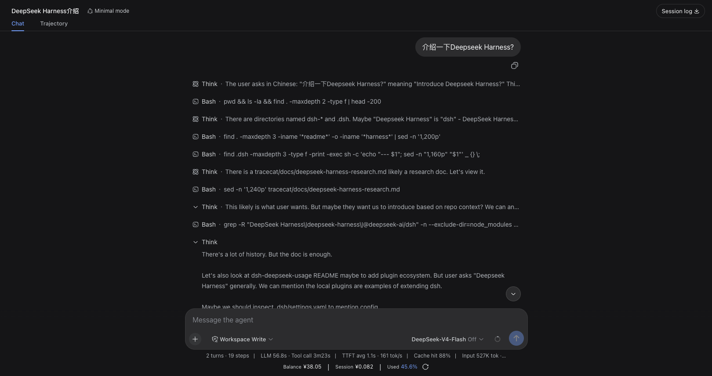
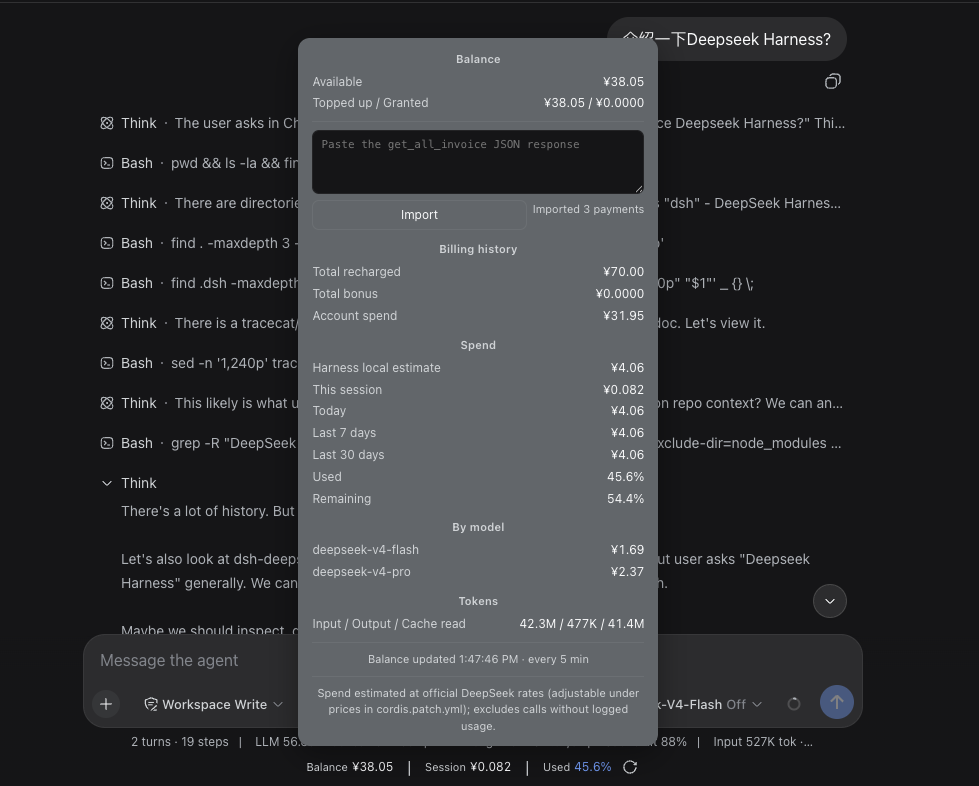

# dsh-balance-stats

**English** | [简体中文](README.zh-CN.md)

`dsh-balance-stats` is a balance and usage statistics plugin for DeepSeek Harness Web. It displays three key figures in a bar below the conversation composer:

```text
Balance ¥40.22 | This session ¥0.15 | Total spent 42.5%
```

Click the bar to open an interactive, scrollable details card with balance composition, Harness local usage estimates, model-level spend, token usage, and historical billing summaries.

## Quick install

Make sure Node.js `>=22.19.0` is installed and `pnpm --version` works, then run:

```sh
npx @deepseek-ai/dsh plugin --profile web add https://github.com/pangzi499/dsh-balance-stats.git
```

Start or restart Harness Web, then hard-refresh the browser:

```sh
npx @deepseek-ai/dsh web
```

> **Update**: `npx @deepseek-ai/dsh plugin --profile web update dsh-balance-stats`

## Screenshots

**Stats bar** — balance, current session cost, and total spend below the composer:



**Details card** — click the bar to open it: balance composition, billing history, per-model spend, token usage, and the invoice import field:



## Features

- **Balance**: reads the official DeepSeek balance API and shows available, topped-up, and granted balances.
- **This session**: estimates the active conversation cost in real time through the composer-scoped `balanceStatsSessionCost` projection.
- **Total spent**: uses an accounting-based percentage after an invoice import; otherwise falls back to the Harness local estimate.
- **Details card**: shows spend today, over the last 7/30 days, per-model spend, token usage, and update time.
- **JSON invoice import**: accepts a pasted `get_all_invoice` JSON response to calculate historical top-ups and accounting-based total spend. Importing force-refreshes the balance, so every figure updates at once.
- **Caching and resilience**: retains the last successful balance when a request fails and refreshes server/client data on configurable intervals. The refresh button in the stats bar immediately re-fetches the balance from DeepSeek.

<details>
<summary><b>How figures are calculated</b></summary>

### Balance

The server requests:

```text
GET https://api.deepseek.com/user/balance
```

By default, the API key is read from the Harness credential `DEEPSEEK_API_KEY`. It is never sent to the browser.

### Harness local estimate

The plugin scans usage events in Harness conversation logs and calculates spend from model prices using:

- Uncached input tokens
- Cache-hit/write tokens
- Output tokens
- Spend aggregated by date and model

This is a local estimate. It may exclude calls made outside Harness, deleted historical logs, or calls without standard usage events.

`prices` applies to ordinary models and v4 usage before `2026-08-17 00:00 +08:00`.
After that cutoff, v4 usage selects `v4PeakPrices` during `09:00–12:00` and
`14:00–18:00` Beijing time, and `v4OffPeakPrices` at other times. All three
price maps are configurable.

### Historical invoices

The public DeepSeek balance API does not return historical top-ups. To enable accounting-based figures:

1. Sign in to `https://platform.deepseek.com/`.
2. Use browser developer tools to copy the JSON response from `https://platform.deepseek.com/auth-api/v0/users/get_all_invoice`.
3. Click the statistics bar below the composer.
4. Paste the complete JSON into the field at the top of the details card and click Import.

Only top-up orders where `payment_order_status === "SUCCESS"` are counted. Valid grant orders are accumulated separately.

```text
Accounting total = historical top-ups + historical grants
Accounting spend = max(0, accounting total - current total balance)
Total spent = accounting spend / accounting total × 100%
```

Without imported invoices:

```text
Total spent = Harness local estimated spend
              / (current total balance + Harness local estimated spend)
              × 100%
```

</details>

<details>
<summary><b>Privacy and storage</b></summary>

- The plugin never requests `get_all_invoice` or stores DeepSeek Platform cookies.
- Pasted JSON is parsed only in the current page's memory and cleared immediately after a successful import.
- Only aggregate values—historical top-ups, grants, order count, currency, and import time—are saved in the current browser's `localStorage`.
- Order IDs, payment channels, and transaction details are not persisted.
- Clearing site data requires you to import the invoice summary again.

`get_all_invoice` is a private, authenticated DeepSeek Platform endpoint and its response format may change. Never share cookies, authorization headers, or raw JSON containing order details.

</details>

## Requirements

- Tested with DeepSeek Harness: `0.1.0-rc.6`
- Node.js: `>=22.19.0`
- pnpm: must be available on `PATH` because Harness uses it to manage profile plugins (missing? see [Installation](#installation))
- Tested environment: OrbStack Ubuntu with Node.js `24.19.0`

> DeepSeek Harness is still in developer preview. The client APIs and mounting slot used by this plugin may change in upstream releases.

This is a community plugin for DeepSeek Harness. It is not an official `@deepseek-ai` plugin.

## Installation

### GitHub (recommended)

Install the latest version from the default branch:

```sh
npx @deepseek-ai/dsh plugin --profile web add https://github.com/pangzi499/dsh-balance-stats.git
npx @deepseek-ai/dsh web
```

Repository: <https://github.com/pangzi499/dsh-balance-stats>

You can also download `dsh-balance-stats-0.1.4.tgz` from the GitHub Release and install it as a tarball.

<details>
<summary><b>pnpm prerequisite</b></summary>

Harness manages profile plugins with pnpm. Check it before installing:

```sh
pnpm --version
command -v pnpm
```

If pnpm is missing, install it with Corepack:

```sh
corepack enable
corepack prepare pnpm@10 --activate
pnpm --version
```

If Corepack is unavailable in your Node.js installation, use npm:

```sh
npm install --global pnpm@10
pnpm --version
```

</details>

<details>
<summary><b>Local directory / Tarball</b></summary>

### Local directory

```sh
npx @deepseek-ai/dsh plugin --profile web add /absolute/path/to/dsh-balance-stats
npx @deepseek-ai/dsh web
```

### Tarball

Build:

```sh
cd /path/to/dsh-balance-stats
npm pack
```

Install:

```sh
npx @deepseek-ai/dsh plugin --profile web add /absolute/path/to/dsh-balance-stats-0.1.4.tgz
npx @deepseek-ai/dsh web
```

Then hard-refresh the browser (macOS: `Command + Shift + R`; Windows/Linux: `Ctrl + Shift + R`).

</details>

## Updating

For GitHub one-line installs, the update command is in [Quick install](#quick-install) above.

For local-directory or tarball installations, run `add` again with the new path, then restart `dsh web`.

<details>
<summary><b>Configuration</b></summary>

Override plugin configuration in `$DSH_HOME/profiles/web/cordis.patch.yml`. Configuration is replaced as a whole, so repeat every key you want to retain:

```yaml
- id: dsh-balance-stats
  config:
    apiKey: ''
    apiKeyRef: DEEPSEEK_API_KEY
    baseUrl: https://api.deepseek.com
    refreshIntervalMs: 300000
    clientPollIntervalMs: 30000
    timeoutMs: 8000
    currency: CNY
    prices:
      deepseek-chat: { cacheHit: 0.1, cacheMiss: 1, output: 2 }
      deepseek-reasoner: { cacheHit: 1, cacheMiss: 4, output: 16 }
      deepseek-v4-flash: { cacheHit: 0.02, cacheMiss: 0.1, output: 0.2 }
      deepseek-v4-pro: { cacheHit: 0.025, cacheMiss: 3, output: 6 }
    v4PeakPrices:
      deepseek-v4-flash: { cacheHit: 0.10, cacheMiss: 3.0, output: 9.0 }
      deepseek-v4-pro: { cacheHit: 0.30, cacheMiss: 9.0, output: 27.0 }
    v4OffPeakPrices:
      deepseek-v4-flash: { cacheHit: 0.05, cacheMiss: 1.5, output: 4.5 }
      deepseek-v4-pro: { cacheHit: 0.15, cacheMiss: 4.5, output: 13.5 }
    defaultPrices: { cacheHit: 0.1, cacheMiss: 1, output: 2 }
```

Prefer `apiKeyRef` so the plugin reuses Harness credentials. Never put a real API key in a `cordis.patch.yml` file that you plan to share.

</details>

<details>
<summary><b>Verification</b></summary>

After starting the Web profile:

```sh
curl http://127.0.0.1:3080/balance-stats
curl http://127.0.0.1:3080/plugins/dsh-balance-stats/client.js
```

Example statistics response (amounts are illustrative):

```json
{
  "ok": true,
  "currency": "CNY",
  "balances": [
    { "currency": "CNY", "total": 40.22, "granted": 0, "toppedUp": 40.22 }
  ],
  "stats": {
    "state": "ok",
    "totalCost": 2.103612,
    "percent": 5,
    "today": 2.103612,
    "day7": 2.103612,
    "day30": 2.103612,
    "sessions": 10
  }
}
```

</details>

## Known limitations

- Harness local spend is an estimate, not an official DeepSeek invoice.
- Historical invoice summaries depend on the private `get_all_invoice` response format.
- Invoice summaries are browser-local and do not sync across browsers or devices.
- Balance, invoice, and estimated-price currencies must match.
- Upstream changes to DSH client slots or projection APIs may require plugin updates.

## Uninstall

```sh
npx @deepseek-ai/dsh plugin --profile web remove dsh-balance-stats
```

## License

MIT
